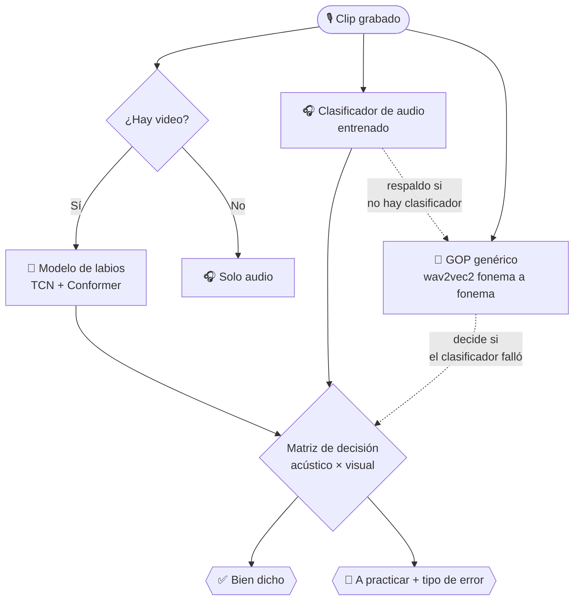

<div align="center">


**Una app web que ayuda a chicos a practicar sonidos difíciles del español —
C/K, G suave, sinfones, S y RR fuerte — escuchando su voz y mirando su boca
con IA, en tiempo real, sin instalar nada.**


</div>

---

## 🧩 Qué es FonoKids

Un chico con dislalia (dificultad para pronunciar ciertos sonidos) practica
diciendo palabras y frases frente a la cámara/micrófono del navegador.
FonoKids escucha la **pronunciación real** (no un reconocedor de voz
genérico) y, cuando hay cámara, también mira **cómo se mueve la boca** —
y con eso arma un veredicto honesto: bien dicho, o en qué parte exacta
falló (la lengua se adelantó, el sonido salió flojo, metió una vocal de
más, etc.), con un consejo concreto para la próxima toma.

No es un juego de "repetí y listo": cada evaluación corre contra modelos
entrenados de verdad (no reglas inventadas), y toda la interfaz —textos,
feedback, ritmo— está pensada para un chico, no para un adulto: nada de
porcentajes en pantalla, nada de jerga clínica, emojis grandes en vez de
mensajes de "error".

## 📋 Tabla de contenidos

- [Funcionalidades](#-funcionalidades)
- [Cómo decide si está bien o mal dicho](#-cómo-decide-si-está-bien-o-mal-dicho)
- [Sonidos que trabaja](#-sonidos-que-trabaja)
- [Arquitectura](#️-arquitectura)
- [Estructura del repo](#-estructura-del-repo)
- [Puesta en marcha](#-puesta-en-marcha)
- [Cómo se entrena y actualiza cada modelo](#-cómo-se-entrena-y-actualiza-cada-modelo)
- [Qué sigue](#️-qué-sigue)

## ✨ Funcionalidades

#### 🧭 Diagnóstico inicial
La primera vez que se abre la app, le pide al chico decir **5 frases
completas** (una por cada sonido difícil) para saber de entrada en qué
sonidos le cuesta más, y arma el camino de práctica a su medida —en vez
de mostrarle las 5 categorías por igual.

#### 🧭 Aprender — camino de etapas
Categorías de sonidos → palabras → pasos, estilo "camino" (una etapa por
palabra). El paso final de cada palabra se puede practicar de dos formas:

- **📷 Con cámara** — graba un clip corto, se evalúa audio *y* movimiento
  de labios juntos.
- **🎤 Solo con la voz** — en vez de decir la palabra sola, dice una
  **frase completa y natural** ("la sandía es dulce y roja") y el sistema
  ubica y evalúa *solo* la palabra entrenada dentro de esa frase —
  practicar en contexto real, no palabras sueltas.

Para RR, además hay un desglose en 4 pasos (sonido suelto → doble → a
medias → palabra completa), pensado como andamiaje pedagógico para el
sonido que más tarda en adquirirse.

#### 🔄 Repaso espaciado
Las palabras que el chico ya domina no desaparecen para siempre: si pasan
3 días o más sin practicarlas, vuelven a aparecer en una sección
"Para repasar" en la pantalla principal, para que no se le olviden.

#### 🎚️ Dificultad que se ajusta sola
Si falla 3 veces seguidas en lo mismo, la app no insiste de una —ofrece
una pausa de repetición libre (escuchar y repetir sin evaluar, sin
presión) antes de dejarlo intentar de nuevo. Funciona para cualquier
categoría, no solo para RR.

#### 🔊 Sonidos
Practicar cualquier sonido suelto con texto a voz (TTS), sin depender de
una etapa del camino — para repasar libremente.

#### 🏆 Logros / 🔁 Para practicar
Historial real de intentos (no inventado): lo que salió bien queda en
Logros, lo que salió mal queda en Para practicar con el tipo de error
específico y un consejo para la próxima vez.

#### 👶 Pensado para chicos, no para adultos
- Nada de porcentajes ni números de confianza en pantalla.
- Feedback con emoji grande (😄 / 😅) en vez de mensajes de "error".
- Nunca se le dice al chico una transcripción fonética cruda tipo
  "sonó como *krrabo*" — confuso para alguien que recién aprende a leer.
- Si dice solo la palabra en vez de la frase completa pedida, o cambia
  otra palabra de la frase, el intento no cuenta — tiene que decir la
  frase pedida de punta a punta para que valga.

## 🧠 Cómo decide si está bien o mal dicho

FonoKids combina **dos señales independientes** y nunca confía en una
sola fuente:

1. **🎧 Audio** — un clasificador entrenado específicamente con la voz de
   quien practica (≈98-99% de accuracy en validación) le gana al
   reconocimiento fonético genérico (GOP, *Goodness of Pronunciation*,
   sobre `wav2vec2-xlsr-53-espeak-cv-ft`) cuando está disponible; el GOP
   genérico queda de respaldo para cuando el clasificador no pudo correr.
2. **👄 Video** (solo en modo cámara) — un modelo TCN + Conformer mira la
   secuencia de puntos de la boca (landmarks) y decide si el movimiento
   coincide con la palabra esperada.



Para el modo **frase completa**, antes de evaluar nada se chequean dos
cosas con el mismo motor de alineación fonética (GOP sobre la frase
entera):

- **¿Dijo la frase entera**, o solo la palabra suelta? Se compara el
  largo de lo reconocido contra el largo esperado de la frase.
- **¿La frase es la que se pidió**, o cambió otra palabra en el camino
  (ej. "la torre es muy **baja**" en vez de "**alta**")? Se revisan los
  fonemas de la frase que quedan *fuera* del tramo de la palabra
  objetivo.

Si cualquiera de las dos falla, el intento **no cuenta** — ni se evalúa
ni se guarda, directo se le pide repetir la frase tal cual.

Recién si pasó esos dos filtros, se recorta el audio justo al tramo de
la palabra objetivo (con su margen de silencio natural) y se le pasa al
mismo clasificador entrenado que se usa en modo palabra sola — así una
frase completa se evalúa con la misma precisión que decir la palabra
aislada.

## 🔊 Sonidos que trabaja

Solo categorías con datos de entrenamiento reales (nada de relleno sin
evidencia):

| Categoría | Palabras | Por qué cuesta |
|---|---|---|
| **C / K** | casa, cama, cohete, copa, cubo | Sonido de atrás de la boca, sin vibración — a veces se cambia por T |
| **G suave** | gato, goma, gota, gusano | Sonido de atrás de la boca, con vibración — a veces se cambia por D |
| **Sinfones** | blanco, flor, globo, plátano, clavo | Dos consonantes seguidas — la boca tiene que cambiar rápido de posición sin meter una vocal en el medio |
| **S (sigmatismo)** | sandía, sapo, sopa, serpiente, silla | La lengua se va entre los dientes y suena como una Z |
| **RR fuerte** | perro, carro, torre, burro, gorra | Lengua vibrando — el sonido que más tarda en adquirirse (normal recién a los 4-5 años) |

Ordenadas de menos a más difícil según cuándo se adquiere cada sonido
normalmente en español.

## 🏗️ Arquitectura

| Capa | Tecnología |
|---|---|
| Frontend | React + Vite, sin frameworks de UI — CSS propio pensado para chicos |
| Backend | FastAPI (Python), un único proceso HTTP en `localhost` |
| Modelo visual | TCN + Conformer sobre landmarks de labios (MediaPipe FaceLandmarker para extraerlos, `face-alignment`/HRNet para el detector en vivo) |
| Modelo de audio (fonético) | `facebook/wav2vec2-xlsr-53-espeak-cv-ft` — GOP genérico, sin entrenamiento propio, con conversor texto→fonema propio para español |
| Clasificador de audio entrenado | Red densa sobre embeddings de wav2vec2, entrenada con clips reales de cada palabra (`scripts/train_audio_classifier.py`) |
| Persistencia | MySQL (vía XAMPP) para el historial de intentos — si no está disponible, la app sigue funcionando igual, solo sin guardar historial |

Todo corre **100% local** — el servidor solo escucha en `localhost`, no
se expone a la red, y no se manda audio/video a ningún servicio externo.

## 📁 Estructura del repo

```
├── scripts/                      # Pipeline de datos y entrenamiento
│   ├── grabar_video_continuo.py      # Graba clips (video + audio) por clase
│   ├── extraer_landmarks_npy.py      # Extrae landmarks de labios
│   ├── train_landmarks_transformer.py# Entrena el modelo visual (TCN+Conformer)
│   ├── train_audio_classifier.py     # Entrena el clasificador de audio
│   └── audio_pronunciation.py        # GOP: evalúa pronunciación por fonema
├── server/                       # API (FastAPI)
│   ├── main.py                       # Endpoints + lógica de decisión
│   ├── db.py                         # Persistencia en MySQL
│   ├── run.sh / watchdog.sh          # Relanzan el server si se cuelga
├── web/                          # App React + Vite
│   └── src/
│       ├── screens/                  # Aprender, Sonidos, Logros, Para practicar, Diagnóstico
│       ├── soundCategories.js        # Fuente única de categorías/palabras
│       ├── frases.js                 # Frases naturales por palabra
│       └── api.js                    # Cliente HTTP del backend
├── data/                         # Dataset grabado (no versionado, pesa mucho)
└── models/                       # Checkpoints entrenados (no versionado)
```

## 🚀 Puesta en marcha

**1. Backend**

```bash
pip install -r requirements.txt
python server/main.py
```

Queda escuchando en `http://localhost:8000`. La primera vez tarda ~30s en
cargar (descarga el modelo de audio pre-entrenado y calienta el detector
de landmarks).

Opcional — para que se reinicie solo si se cuelga:
```bash
bash server/run.sh        # relanza main.py si el proceso muere
bash server/watchdog.sh   # lo mata y fuerza reinicio si deja de responder
```

**2. Base de datos (opcional)**

Si hay un MySQL corriendo en `127.0.0.1:3306` con una base `speakshadow`,
el historial de Logros/Para practicar queda persistido ahí. Sin MySQL, la
app funciona igual — solo que el historial no sobrevive a un reinicio del
server más allá de lo que haya en disco.

**3. Frontend**

```bash
cd web
npm install
npm run dev
```

Abrí `http://localhost:5173` — pide permiso de cámara/micrófono la
primera vez que se usa un paso con evaluación real.

## 🧪 Cómo se entrena y actualiza cada modelo

| Modelo | Cómo se actualiza |
|---|---|
| **Visual** (`models/best.pth`) | Grabar clips nuevos (`grabar_video_continuo.py`) → extraer landmarks (`extraer_landmarks_npy.py`) → reentrenar (`train_landmarks_transformer.py` local, o el notebook de Colab) → reemplazar el checkpoint y reiniciar el server. |
| **Clasificador de audio** | Mismos clips de arriba (ya traen audio) → `train_audio_classifier.py`. No reentrena el modelo de audio base, solo la cabeza clasificadora sobre sus embeddings. |
| **GOP genérico** | No requiere entrenamiento — es el checkpoint público de Facebook tal cual. Para agregar una palabra nueva solo hace falta mapearla bien a fonemas en `texto_a_fonemas()` (`scripts/audio_pronunciation.py`). |

El nombre de cada clase de entrenamiento ya dice todo lo que hace falta
saber (palabra, si quedó bien, y el subtipo de error si se distingue):

```
<palabra>_correcto
<palabra>_incorrecto
<palabra>_incorrecto_<subtipo>     # ej. lambdacismo, dentalizacion, omision
```

## 🛣️ Qué sigue

- [x] Diagnóstico inicial por sonido
- [x] Practicar con frases completas, no solo palabras sueltas
- [x] Repaso espaciado de lo ya aprendido
- [x] Dificultad que se ajusta sola ante fallos seguidos
- [ ] Reporte de progreso exportable para el fonoaudiólogo/docente
- [ ] Rachas y puntos por constancia
- [ ] Perfil por nombre (sin contraseña) para que varios chicos compartan un mismo dispositivo sin mezclar su progreso

---

<div align="center">
<sub>Hecho para que practicar hablar bien sea un juego, no una tarea.</sub>
</div>
